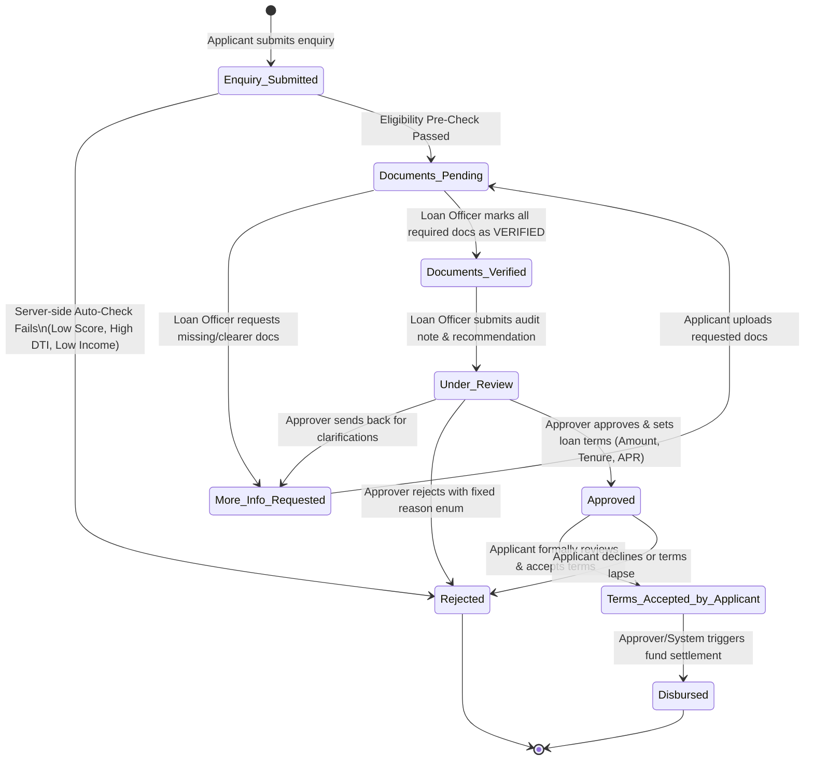
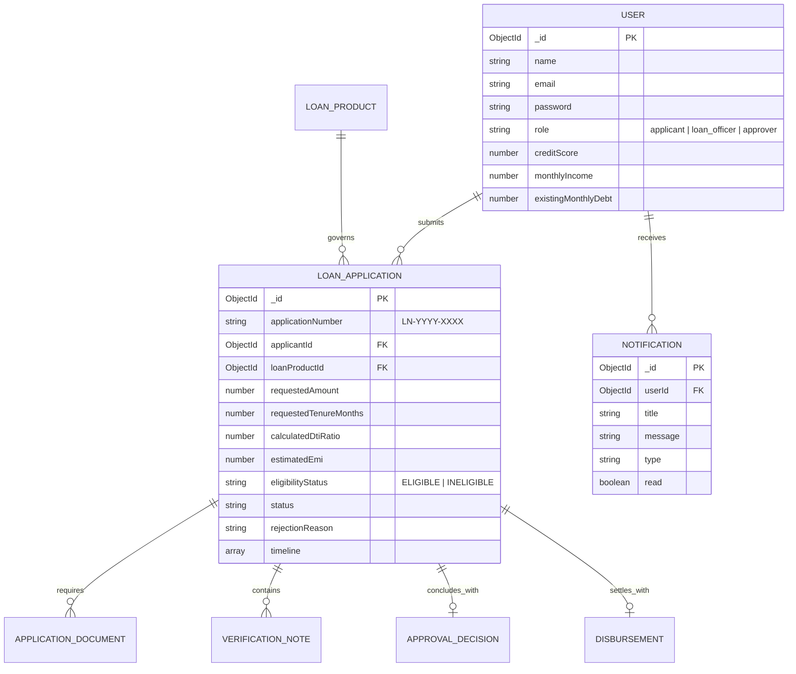

# LoanFlow — AI-Powered MERN Loan Application Tracker & Underwriting Platform

[](#tech-stack)
[](https://nodejs.org/)
[](LICENSE)

A production-ready full-stack enterprise loan origination and lifecycle management system. Built with React (Vite), Node.js/Express, MongoDB/Mongoose, Tailwind CSS, and Google Gemini AI, featuring a deterministic 9-stage state machine, automated policy checks, real-time risk scoring, and interactive analytics.

---

## 🌟 Key Real-World Features & AI Enhancements

### 🤖 1. Multi-Modal AI Layer (Google Gemini 1.5 Flash)
- **AI Credit Risk Assessment Report**: Analyzes applicant credit profile, DTI ratio, verified collateral, and officer notes to generate a structured underwriting narrative (Low/Medium/High risk, pros/cons, conditions).
- **LoanFlow AI Floating Assistant**: Interactive chatbot for applicants and staff to answer questions about required documents, eligibility rules, and loan processes.
- **AI Loan Product Matchmaker**: Recommends the optimal loan product based on user income, score, and borrowing goals.
- **Document Compliance Summarizer**: Generates rapid compliance summaries for loan officers reviewing documentation.

### 🛡️ 2. Enterprise Security & State Machine Architecture
- **Deterministic 9-Stage Workflow Engine**: Strict server-side transition matrix preventing invalid jumps or unauthorized role actions.
- **Institutional Fixed Rejection Enums**: Certified policy rejection codes (`LOW_CREDIT_SCORE`, `HIGH_DEBT_TO_INCOME`, `INCOMPLETE_DOCUMENTS`, etc.).
- **Security Hardening**: `Helmet.js` HTTP security headers, CORS origin isolation, and multi-tier `express-rate-limit` rate limiters (Global, Auth, and AI endpoints).

### 📊 3. Executive Analytics & Monitoring
- **Interactive Recharts Dashboard**: Visualizes 6-month loan trends, status breakdowns, product distributions, approval rates, and average credit metrics.
- **In-App Real-Time Notification Bell**: Unread counter with live polling for status changes, required documents, approval alerts, and disbursement vouchers.
- **Live Financial Simulators**: Reducing-balance monthly EMI & Debt-to-Income (DTI) calculations.

---

## 1. Workflow State Machine

The application status is strictly enforced server-side via a deterministic state machine validator (`workflowStateMachine.js`).



### Server-Side Transition Matrix & Permissions

| From Status | To Status | Allowed Roles | Enforced Pre-conditions & Guards |
|---|---|---|---|
| `*` (New) | `Enquiry-Submitted` | `Applicant` | Blocks duplicate active applications for the same product. |
| `Enquiry-Submitted` | `Documents-Pending` | `System` | Automated eligibility pre-check passes (Income, Score, DTI, Limits). |
| `Enquiry-Submitted` | `Rejected` | `System` | Immediate auto-rejection recording fixed reason code. |
| `Documents-Pending` | `Documents-Verified` | `Loan Officer` | All mandatory documents for the product marked `VERIFIED`. |
| `Documents-Pending` | `More-Info-Requested` | `Loan Officer` | Specific document flagged or remarks provided. |
| `More-Info-Requested` | `Documents-Pending` | `Applicant` | New document uploaded or clarification submitted. |
| `Documents-Verified` | `Under_Review` | `Loan Officer` | Officer verification findings and recommendation recorded. |
| `Under-Review` | `Approved` | `Approver` | All docs must be `VERIFIED`; sanctioned terms (Amount, Tenure, APR) specified. |
| `Under-Review` | `Rejected` | `Approver` | Fixed rejection reason selected from enum; underwriting note recorded. |
| `Under-Review` | `More-Info-Requested` | `Approver` | Clarification remarks recorded. |
| `Approved` | `Terms-Accepted-by-Applicant` | `Applicant` | Applicant explicitly signs/executes loan agreement. |
| `Terms-Accepted-by-Applicant` | `Disbursed` | `Approver` / `System` | Valid bank settlement details provided; generates official voucher & EMI start date. |

---

## 2. Entity Relationship Diagram (ERD)



---

## 3. Pre-Seeded Demo Accounts & Quick Switcher

Use the **1-Click Quick Demo Switcher** in the top navigation bar to test all roles without manual login:

| Persona Name | Email | Password | Role | Test Scenario |
|---|---|---|---|---|
| **Sarah Jenkins** | `applicant.sarah@demo.com` | `password123` | Applicant | Fresh enquiry (`Enquiry-Submitted`), test document uploads. |
| **Laura Bennett** | `applicant.laura@demo.com` | `password123` | Applicant | Approved terms ready for review (`Approved`), accept loan terms. |
| **Robert Taylor** | `applicant.robert@demo.com` | `password123` | Applicant | Auto-rejected on submission (`LOW_CREDIT_SCORE`). |
| **Marcus Vance** | `officer.marcus@bank.com` | `password123` | Loan Officer | Document Verification Workbench & Risk Note Submissions. |
| **Elena Rostova** | `approver.elena@bank.com` | `password123` | Approver | AI Risk Analysis, Underwriting Sanctions & Fund Disbursement. |

---

## 4. Quickstart & Installation

### Prerequisites
- Node.js >= 18
- MongoDB running locally on `mongodb://127.0.0.1:27017`

### 1. Environment Setup
Copy the `.env.example` in the server directory:
```bash
cd server
cp .env.example .env
# Optional: Add your GEMINI_API_KEY for real Gemini AI inferences
```

### 2. Backend Setup
```bash
cd server
npm install
npm run seed       # Seeds products, users, and applications across all 9 stages
npm run dev        # Starts server on http://localhost:5000
```

### 3. Frontend Setup
```bash
cd client
npm install
npm run dev        # Starts Vite application on http://localhost:5173
```

### 4. Automated Test Suite
```bash
cd server
node test-api.js
```
Runs comprehensive automated edge-case validation testing role permissions, duplicate prevention, and full lifecycle execution.
